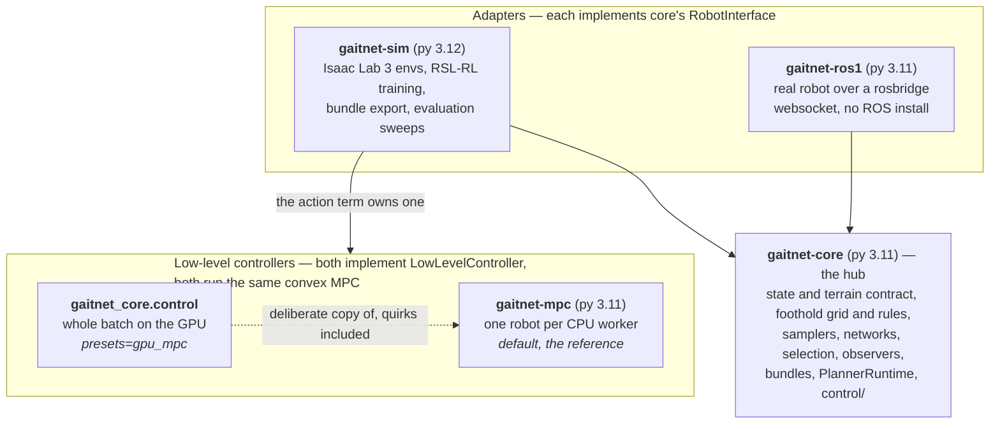
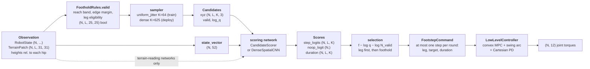
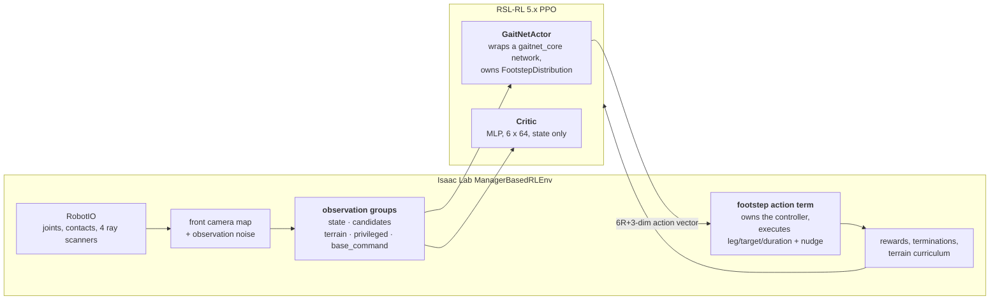
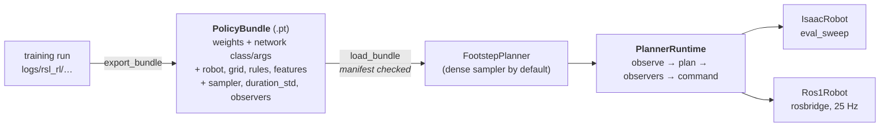
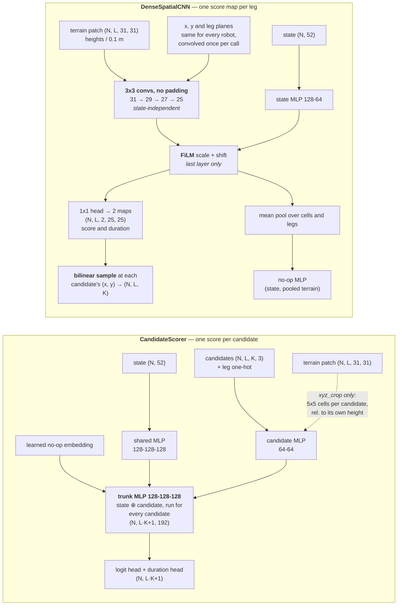

# Architecture

How the pieces of GaitNet fit together, and what every preset switches. [AGENTS.md](AGENTS.md)
is the map of the repo; this is the map of the system.

The package READMEs stay the reference for their own subject — tasks and cfg overrides in
[gaitnet-sim](packages/gaitnet-sim/README.md), the message contract in
[gaitnet-ros1](packages/gaitnet-ros1/README.md), the batched controller in
[control/](packages/gaitnet-core/src/gaitnet_core/control/README.md), run commands in
[docker/](docker/README.md). This page is what none of them can say on their own: the shape
of the whole thing.

- [1. The system](#1-the-system)
- [2. The two scoring networks](#2-the-two-scoring-networks)
- [3. Presets](#3-presets)
- [4. Adding a variant](#4-adding-a-variant)

## 1. The system

A policy scores candidate footholds every planning tick and picks **at most one footstep**,
or none (by default; see [several footsteps per tick](#several-footsteps-per-tick)). There is
no gait: which leg swings, where it lands and for how long are all the policy's choice, made
greedily one step at a time. A convex MPC turns each footstep into
joint torques. The same planner code runs in Isaac Lab and on a real robot, because both
sides implement the same two protocols.

### Packages



Logic both adapters need lives in core, not in one of them. The real robot usually runs its
*own* controller, so on hardware neither box in `ctl` is in the loop — the planner sends
footsteps and the robot executes them.

### The contract

Three things must agree between whoever produced a policy and whoever runs it: the **robot**
([robot_spec.py](packages/gaitnet-core/src/gaitnet_core/robot_spec.py)), the **foothold grid**
([grid.py](packages/gaitnet-core/src/gaitnet_core/grid.py)) and the **foothold rules**
(`FootholdRules` in [planner.py](packages/gaitnet-core/src/gaitnet_core/planner.py)).

| Piece | Default (Go1) | Where it also appears |
| --- | --- | --- |
| Grid | 25 x 25 cells at 0.015 m per leg, border 3 → 31 x 31 patch | `gaitnet_sim.env.contract`, the ray patterns in `gaitnet_sim.env.scene` |
| Reach band | foothold 0.38 m to 0.12 m below the hip | `valid_footholds` |
| Edge rule | a cell whose 3x3 window spans more than 0.02 m is an edge; 2 cells of margin (so slopes over ~0.01 m per cell are all edge) | needs `border >= edge_margin + 1` |
| Leg rule | a leg may lift off only if 2 legs stay in scheduled stance, and (sim default) after 0.08 s of stance | `eligibility.py` |
| Terrain filter | (sim default) the rules and candidate heights read the patch median filtered over 3 x 3 cells | `FootholdRules.heights` |
| Kinematic rules | (sim defaults) footholds 0.06 m from other feet, 0.02 m on the leg's own side of the centre line, within 0.40 m of the hip | `FootholdRules.kinematic` |
| State vector | 8 features, 52 numbers | `gaitnet_core.features.FEATURES`, chosen by name |

The border exists so rules and convolutions see real terrain at the grid's edge instead of
padding. Candidates only ever come from the inner 25 x 25.

A policy bundle records all of it and `load_bundle` validates the manifest against the code,
so a policy cannot silently run on a different state layout or grid than it was trained on.
Leg order is FL, FR, RL, RR everywhere; per-leg vectors are flattened leg-major; units are
SI; frames are base / yaw / hip-yaw.

### One planning tick



Stage by stage:

1. **Observe.** `RobotState` + `TerrainPatch`
   ([state.py](packages/gaitnet-core/src/gaitnet_core/state.py)). `gait_timing` is the
   controller's *schedule*, not a measurement — a foot that lands early still reads as
   swinging until its scheduled touchdown, and the eligibility rule depends on that.
2. **Mask.** `FootholdRules.valid` intersects terrain validity (reachable, away from edges)
   with leg eligibility. The policy never scores a foothold it isn't allowed to take.
3. **Sample.** A sampler turns the mask into K candidates per leg
   ([samplers.py](packages/gaitnet-core/src/gaitnet_core/samplers.py)). `uniform_jitter`
   draws cells without replacement and jitters within each cell, so the continuous foothold
   surface is covered, not just cell centres. `dense` is exhaustive — every cell, no sampling
   variance.
4. **Score.** The network returns `Scores` for every candidate plus a single no-op logit.
   Networks score a *point*, not a cell, which is what makes them sampler-agnostic and
   differentiable in the foothold.
5. **Select.** See below.
6. **Command.** `FootstepCommand` carries `active` (false = no step this tick), leg, target
   in the leg's hip yaw frame, and swing duration.

Between steps 5 and 6, two optional pieces can run:
[**refinement**](packages/gaitnet-core/src/gaitnet_core/refine.py), gradient ascent on the
network's score that moves the chosen foothold off the candidate set while staying on valid
cells; and [**observers**](packages/gaitnet-core/src/gaitnet_core/observers.py), which look
at the whole plan and nudge the controller's velocity command outside the learned policy.

### Several footsteps per tick

`max_steps_per_tick` (R) in the foothold rules (`env.gaitnet.max_steps_per_tick`, saved in the
bundle) lets a tick start up to R footsteps, chosen one after another in *rounds*
([rounds.py](packages/gaitnet-core/src/gaitnet_core/rounds.py)). Round 1 is the one-step
policy. Each later round sees the state as it will be once the earlier rounds' legs have
lifted off: their `gait_timing` reads as a swing of the chosen duration that has just begun.
The leg rule is re-applied to that state, so a round can only step a leg still in stance, and
only while `min_stance_after_step` legs stay down. Choosing the no-op ends the tick. Every round
scores the same candidate set, sampled once per tick, with legs no longer eligible masked out,
so a round costs one more network pass and no sampling.

The tick's policy is the product of the rounds' conditionals: its log-probability is the sum
over the rounds taken, and PPO recomputes it by replaying the stored choices, since round r
depends only on the choices before it. The entropy bonus sums the rounds' categorical
entropies along that path; the adaptive learning rate's KL compares the first round only.
The actor can't read the env's contract, so it repeats `state_features` and
`min_stance_after_step` (`agent.actor.*`), and export refuses a bundle where they disagree.

### The action space, and why logits get corrected

The policy is defined over a continuous space: the no-op, or leg *l* at foothold *x* with a
duration. The network scores points; a candidate set is a Monte-Carlo sample of each leg's
footholds. So a leg's step probability is the **mean** of `exp(f)` over its valid footholds,
not the sum:

```
P(no-op) ∝ exp(f₀)        P(leg l) ∝ mean over valid x of exp(f(s, l, x))        P(x | l) ∝ exp(f(s, l, x))
```

Turning the sum into that mean is what every candidate's corrected logit does:
`f − log q − log N_valid`, where `q` is the sampler's proposal density
([selection.py](packages/gaitnet-core/src/gaitnet_core/selection.py)). That is also what
makes the stochastic policy the same, in expectation, under any sampler.

This is not cosmetic. A flat softmax over candidates plus one no-op atom makes the step side
grow with K, so `p(step)` drifts with `per_leg` — going 16 → 64 moved stepping from ~0.12 to
~0.21. `N_valid` varies per state and leg, so the network cannot learn to cancel it. With the
correction the gate compares *the average quality of available footholds* against the value
of waiting, which is what makes "no good foothold, so hold" expressible at all.

The deterministic policy picks the most likely leg first (`leg_marginals`), then that leg's
best foothold. An argmax over individual candidate logits would instead compare one foothold,
penalized by `log N_l`, against the no-op — biasing toward the no-op harder the more
candidates you draw.

### Training



Two things are worth knowing about this wiring:

**The sampler lives in the environment, not the actor.** `footstep_candidates` is an
observation term, so the candidate set is stored in the rollout buffer with the step. PPO can
then recompute log-probabilities on exactly the set the action was drawn from. At deployment
the planner samples for itself. Same sampler code either way.

**The action vector carries both the choice and its consequence**
([action_layout.py](packages/gaitnet-core/src/gaitnet_core/action_layout.py), 6R + 3
numbers, 9 for one round): per round, `choice_index` and `duration` are what
log-probabilities are computed from and `leg`, `target` are what the environment executes;
then the `nudge`. The env never needs the candidate set, and starts the rounds' footsteps one
after another (both controllers keep each leg's swing apart). `step_taken` counts steps, so
every step costs the same however many share a tick.

The swing duration is a Gaussian around the network's mean, with one learned std that has a
floor (`agent.actor.duration_std_floor`, 0.01 s) because it gets no entropy bonus and otherwise
shrinks to nothing. The env clamps the duration it executes to the robot's
`swing_duration_range` (`env.actions.footstep.clamp_duration`); the log-probability keeps the
sample as drawn. Exported bundles record the std including the floor.

Observers are part of the environment's *dynamics*, not the policy: the nudge is in the
action vector but log-probabilities ignore it, and observers only run with gradients off so
PPO's update passes don't advance their memory.

Rates: 250 Hz physics and torque control, 25 Hz planning (`decimation = 10`), MPC re-solve
every 5th control step, 20 s episodes, 250 rollout steps per env per iteration.

### Bundles and deployment



`PlannerRuntime` is the same loop in both cases
([runtime.py](packages/gaitnet-core/src/gaitnet_core/runtime.py)). On hardware it ticks as
observations arrive (`rate_hz=None`) so the robot sets the pace; in the sim it ticks with the
env. `FORMAT_VERSION` in [bundle.py](packages/gaitnet-core/src/gaitnet_core/bundle.py) is
bumped when the *format* changes; a change to features, grid or network arguments invalidates
existing bundles without a bump, and loading will say so. Format 3 added
`rules.max_steps_per_tick`; format 2 bundles still load, as one-footstep policies.

### The two low-level controllers

Both implement `LowLevelController` and run the same convex single-rigid-body MPC, a Bezier
swing arc and a Cartesian PD through the leg Jacobian.
`gaitnet_core.control` is a **deliberate copy** of `gaitnet-mpc`, quirks included: every
bundle, reward weight and evaluation baseline in the repo was produced against the CPU pool,
so "improving" one silently invalidates the comparisons. Torque agreement, cost per step and
the handful of intentional differences are in
[control/README.md](packages/gaitnet-core/src/gaitnet_core/control/README.md). Switching
between them is a sim2real-relevant change, not a pure speed-up.

## 2. The two scoring networks

Both satisfy the same signature — `network(state, candidates, terrain) -> Scores` — and both
plug into the same selection math, refinement and bundle format. They differ in *what they
look at* and *where the candidate dimension K enters the computation*.



Read the two columns for where `K` appears. On the left it is in the tensor from the first
layer to the last: the trunk runs once per candidate. On the right it appears only in the
final `grid_sample` — everything above it is computed per *leg*, at a cost fixed by the patch
size.

| | `CandidateScorer` | `DenseSpatialCNN` |
| --- | --- | --- |
| **Terrain seen** | none with `xyz`; 5 x 5 cells (0.06 m centre to centre) around each candidate with `xyz_crop` | the whole 31 x 31 patch (0.45 m) per leg |
| **Receptive field per score** | the crop, or nothing | 7 x 7 cells (0.09 m), plus a global pool for the no-op |
| **Height reference** | crop heights are relative to the candidate's own z, so it sees roughness but not reach | hip-relative heights, so reach and roughness are both visible |
| **Where the state enters** | concatenated with each candidate, three trunk layers of interaction | once, as FiLM scale/shift on the last conv layer |
| **Weight sharing over space** | none — the MLP learns each (x, y) mapping separately | convolutional, with x/y/leg planes deliberately re-breaking equivariance so hip-relative position is known |
| **Cost in K** | linear | constant, plus one bilinear sample per candidate |
| **Cost of `sampler=dense`** | ~10x (K = 64 → 625) | unchanged |
| **The no-op** | a learned embedding through the same trunk — same function class as a candidate, but state-only, terrain-blind | a separate MLP over state ⊕ pooled terrain features, so the value of waiting can depend on the terrain (pooling is unmasked) |
| **Duration** | a second head off the per-candidate trunk | a second channel of the score map, so it is a smooth spatial field |
| **Score surface in (x, y)** | a smooth MLP; refinement follows a true local gradient | piecewise-bilinear over 1.5 cm cells; refinement can't resolve sub-cell structure |
| **Bundle coupling** | none, unless `xyz_crop` (then the grid) | built for one foothold grid; changing `env.gaitnet.grid_*` invalidates it |
| **Measured update cost*** | 0.44 s (`xyz`), 0.56 s (`xyz_crop`) | 1.86 s |

\* forward + backward on one PPO minibatch (64000 rows, 4 legs x 64 candidates) on an RTX
5070 Ti; PPO runs 32 per iteration.

The trade is legible in the table: the CNN buys a large receptive field and K-independent
cost by giving up per-candidate state interaction. Its score is
`(state-dependent affine) ∘ (fixed terrain features)` — a strictly narrower function class
than the scorer's trunk. Per-layer FiLM was tried and dropped: the elementwise work over a
29 x 29 x 16 map outweighed the convolutions themselves.

At the default K = 64 the CNN is ~4x *more* expensive per update, and its `terrain`
observation group costs ~4 GB of rollout storage at 1024 envs x 250 steps. It wins on
scaling and on what it can see, not at the default operating point.

## 3. Presets

A preset is an Isaac Lab `preset(...)` field. `presets=<name>[,<name>...]` switches every
field that has an alternative of that name, in the **env cfg and the agent cfg together**, so
a variant's network and the observation group it reads can't get out of step. Presets compose.

```bash
docker compose -f docker/compose.yaml run --rm sim -m gaitnet_sim.scripts.train \
    --task GaitNet-Pillars --num_envs 1024 presets=spatial,privileged
```

The optional observation groups are off by default because RSL-RL keeps every group in its
rollout buffer.

| Preset | Switches | For |
| --- | --- | --- |
| *(none)* | `CandidateScorer` + `xyz`, groups `state` and `candidates`, CPU MPC pool | the baseline |
| [`spatial`](#spatial) | `terrain` group on, actor → `DenseSpatialCNN` | terrain-aware policies |
| [`crop`](#crop) | `terrain` group on, actor → `CandidateScorer` + `xyz_crop` | cheap terrain awareness |
| [`privileged`](#privileged) | `privileged` group on, critic reads `state` + `privileged` | better value estimates |
| [`slowdown`](#slowdown) | `base_command` group on, actor runs `step_confidence_slowdown` | behaviour feedback outside the policy |
| [`swing_duration_ablation`](#swing_duration_ablation) | actor → `CandidateScorer` with `fixed_duration=0.25` | does the network need to choose the swing duration? |
| [`gpu_mpc`](#gpu_mpc) | action term's controller → `BatchedMpcController` | large env counts |

### `spatial`

| | |
| --- | --- |
| Env | `observations.terrain` = `TerrainCfg()` ([env_cfg.py:74](packages/gaitnet-sim/src/gaitnet_sim/env/env_cfg.py#L74)) |
| Agent | `actor.network` = `DENSE_SPATIAL_CNN` ([agent_cfg.py:73](packages/gaitnet-sim/src/gaitnet_sim/rl/agent_cfg.py#L73)) |
| Cost | 1.86 s per update (vs 0.44 s), ~4 GB extra rollout storage at 1024 x 250 |

The D1 policy: a small CNN reads each leg's height patch and outputs a score map and a
duration map over the candidate grid; a candidate's score is that map interpolated at its
(x, y). See [section 2](#2-the-two-scoring-networks).

This is the answer to the baseline's terrain-blindness. With `xyz` candidate features the
policy sees terrain *only* as which cells passed the binary validity mask — on flat ground,
zero information. Defaults: `channels=[16, 16, 16]`, `state_sizes=[128, 64]`,
`noop_sizes=[64]`, overridable as `agent.actor.network.channels=[8,8,8]` and so on.

**Gotcha.** The network is built for the env's grid and the bundle records both. Changing
`env.gaitnet.grid_*` needs `agent.actor.network.grid.*` to match; export refuses a mismatch,
and `GaitNetActor` refuses a patch size that doesn't fit at construction.

### `crop`

| | |
| --- | --- |
| Env | `observations.terrain` = `TerrainCfg()` (the same group as `spatial`) |
| Agent | `actor.network` = `CROP_SCORER` — `CandidateScorer` with `candidate_features="xyz_crop"`, `crop_radius=2` |
| Cost | 0.56 s per update, same ~4 GB of rollout storage |

Keeps the baseline architecture and gives each candidate a 5 x 5 window of terrain around it,
relative to its own height. Much cheaper than `spatial` and a useful ablation: it separates
"the policy needs terrain" from "the policy needs a *wide* view of terrain".

**Gotcha.** `spatial` and `crop` are the only two presets that collide: both set
`agent.actor.network`. Passing both is not an error, only one takes effect (the first), so
don't — pick one per run.

### `swing_duration_ablation`

| | |
| --- | --- |
| Agent | `actor.network` = `CandidateScorer` + `fixed_duration=0.25` ([agent_cfg.py](packages/gaitnet-sim/src/gaitnet_sim/rl/agent_cfg.py)) |

Takes the swing duration out of the policy: every step is commanded for 0.25 s, dial it with
`agent.actor.network.fixed_duration=0.3`. The network has no duration head, the duration is
never sampled and isn't in the log-probability, so the policy is the categorical choice alone.
`fixed_duration` is a network argument, so it is saved in the bundle and deployment needs
nothing extra. Both networks accept it, but the preset only sets it on the baseline scorer;
it collides with `spatial` and `crop` like they do with each other (first wins), so it
doesn't compose with them yet.

### `privileged`

| | |
| --- | --- |
| Env | `observations.privileged` = `PrivilegedCfg()` |
| Agent | `obs_groups["critic"]` = `["state", "privileged"]` ([agent_cfg.py:90](packages/gaitnet-sim/src/gaitnet_sim/rl/agent_cfg.py#L90)) |
| Cost | ~0 |

Sim-only inputs for the critic only — the actor's groups are untouched, so a policy trained
with it deploys unchanged. The group is each leg's terrain averaged to 5 x 5, the fraction of
valid footholds in each 5 x 5 block, the base's clearance above the terrain, and per-foot
contact forces. Privileged terms read the *truth*, not the noise-corrupted planner view.

The critic is a plain 6 x 64 MLP over its groups either way — RSL-RL's own model in training,
`gaitnet_core.networks.Critic` elsewhere. It never sees candidates: those are i.i.d. draws
given the state, so they carry ~no information about V(s). `privileged` is the only preset
that changes what the value function knows.

### `slowdown`

| | |
| --- | --- |
| Env | `observations.base_command` = `BaseCommandCfg()` — the operator's command *before* any nudge |
| Agent | `actor.observers` = `{"step_confidence_slowdown": {"patience": 10, "margin": 0.0, "scale": 0.5}}` |
| Cost | ~0 |

`StepConfidenceSlowdown` watches the gate: on ticks where some leg *may* step but the no-op
logit beats the best leg marginal by more than `margin`, a counter increments. After
`patience` consecutive such ticks the operator's command is scaled by `scale` until a tick
where stepping wins. Ticks where no leg may step (the gait's own swings) neither count nor
break the run.

The nudge is environment dynamics, not policy: the env applies it, the policy observes the
nudged command, and the tracking rewards follow it by default
(`env.rewards.xy_tracking.params.command=base` tracks the operator's command instead).
Log-probabilities ignore the nudge, observers run only with gradients off, and they are reset
for envs whose episode ended.

Exported bundles carry their observers, because the policy was trained under them, and
`eval_sweep` runs them unless given `--no_observers`. Parameters override as
`agent.actor.observers.step_confidence_slowdown.patience=5`.

### `gpu_mpc`

| | |
| --- | --- |
| Env | `actions.footstep.controller` = `BatchedMpcControllerCfg()` ([actions_cfg.py:20](packages/gaitnet-sim/src/gaitnet_sim/env/actions_cfg.py#L20)) |
| Agent | — |
| Cost | a saving: 6.6 → 5.0 ms per control step at 100 envs, 223 → 36.8 ms at 4096 |

Runs the same convex MPC for the whole batch on the GPU instead of one robot per CPU worker.
This is what makes large env counts affordable; past a few hundred envs, rollouts stop being
MPC-bound and the GPU policy starts to matter.

**Gotcha.** This is a sim2real-relevant change, not a pure speed-up. The two controllers
agree to well under a percent of joint torque but not exactly, and every bundle and baseline
in the repo was produced against the CPU pool — compare a policy trained under one against
the other before trusting a result that crosses them. More solver iterations narrow the gap:
`presets=gpu_mpc env.actions.footstep.controller.solver_iterations=100`.

### Composing and overriding

Presets are resolved by name across every `preset(...)` field, so ones that touch disjoint
fields compose freely: `presets=spatial,privileged,gpu_mpc` is the large-scale terrain-aware
setup. Only `spatial` and `crop` collide.

A field that *is* a preset (`agent.actor.network`, `agent.actor.observers`,
`agent.obs_groups.critic`, the optional observation groups) can't be replaced whole with a
command-line override — Isaac Lab reads that as choosing a preset by name. Override its keys,
or add a preset. `packages/gaitnet-sim/tests/test_presets.py` checks that the recipes in the
[sim README](packages/gaitnet-sim/README.md#overrides) resolve as documented.

## 4. Adding a variant

Every extension point is a registry in `gaitnet-core`, so a new variant is an entry plus a
preset:

| Want | Add to |
| --- | --- |
| A state feature | `gaitnet_core.features.FEATURES` |
| A candidate encoding | `gaitnet_core.networks.CANDIDATE_FEATURES` |
| A scoring network | `gaitnet_core.networks.NETWORKS` — takes `(state, candidates, terrain)`, returns `Scores`, sets `uses_terrain` if it reads terrain, exposes `self.config` |
| A candidate sampler | `gaitnet_core.samplers.SAMPLERS` |
| A feedback observer | `gaitnet_core.observers.OBSERVERS` |
| A low-level controller | anything implementing `gaitnet_core.interfaces.LowLevelController` |

Then give it a preset: a field with the variant's name on the relevant `preset(...)` in
[env_cfg.py](packages/gaitnet-sim/src/gaitnet_sim/env/env_cfg.py) and
[agent_cfg.py](packages/gaitnet-sim/src/gaitnet_sim/rl/agent_cfg.py), a row in the
[sim README](packages/gaitnet-sim/README.md#presets) table, and a section in
[§3](#3-presets) above.
